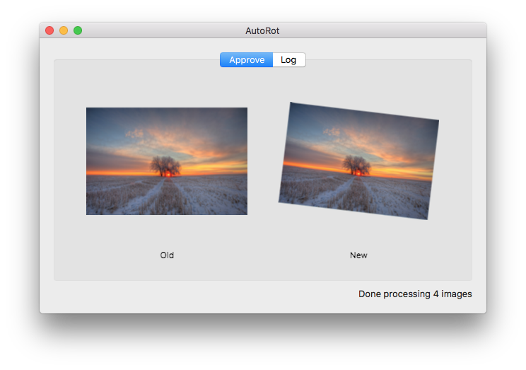

# autorot (Mac)

This is a front-end for my [autorot](https://github.com/unixpickle/autorot) project, which aims to use a neural network to automatically straighten out images.

Currently, this project is under development. There are a few (required) autorot files which are not included in this repository. I plan to add them in once I get an autorot network with good enough performance.

The application starts by prompting the user to choose a directory full of images. Then, it presents a series of pre- and post- rotations and has the user pick (using the arrow keys) whether to keep the old version or choose the rotated version. This allows the user to override the neural net when it makes mistakes.

